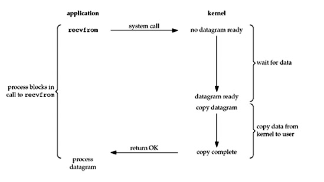
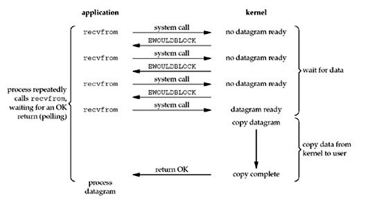
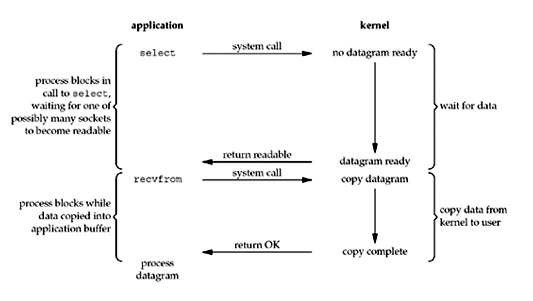

# 操作系统相关的面试题

[直接看大佬的github](https://github.com/CyC2018/Backend-Interview-Guide/blob/master/doc/%E4%B8%80%E6%96%87%E5%B8%AE%E4%BD%A0%E7%90%86%E6%B8%85%E9%9D%A2%E8%AF%95%E7%9F%A5%E8%AF%86%E7%82%B9.md)

```markdown
前言：
1. 分布式与系统设计部分对于大厂面试来说至关重要，但是小厂面试考察的会少一点。
2. 语言基础部分，阿里喜欢问 Java、腾讯喜欢问 C++，其它大厂面试考察会少一些，小厂面试会考察多一些。
3. 数据库、中间件和框架部分对于大厂面试来说不是那么重要，但是对于小厂面试会重要一些。
```

--------------------

### 1. ★★★ 进程与线程的本质区别、以及各自的使用场景。

    1. 拥有资源
       进程是资源分配的基本单位，进程拥有代码和打开的文件资源、数据资源、独立的内存空间。但是线程不拥有资源，线程可以访问隶属进程的资源。
    
    2. 调度
       线程是独立调度的基本单位，在同一进程中，线程的切换不会引起进程的切换，从一个进程的线程切换到另一个进程中的线程，会引起进程的切换。
    
    3. 系统开销
       由于创建和撤销进程时，系统都要为其分配或者时回收资源，如内存空间、I/O设备等等，所付出的开销远远大于创建或撤销线程时候的开销。类似地，在进行进程切换的时候，涉及当前执行进程的CPU环境的保存以及新调度的进程的CPU环境的配置。而线程切换的时候只是保存少量的寄存器的内容，开销小。
    
    4. 通信方面
       线程之间可以通过直接读写同一进程中的数据进行通信，但是进程间通信需要借助IPC

---------------------

### 2. ★☆☆ 进程状态。

    创建状态、就绪状态（等待被调度）、运行状态、阻塞状态（等待资源）、中止状态

[进程的五状态图](https://github.com/LydiaCai1203/leetcode-practice/blob/master/static/ProcessState.png)

##### 要点解读：

```markdown
  1. 就绪状态的进程通过调度算法来获得CPU的运行时间，转为运行状态；而运行状态的进程，在分配给它的CPU时间片用完了以后就会回到就绪状态。等待下一次的调度。

  2. 阻塞状态是缺少需要的资源而从运行状态转换而来的，但是该资源不包括CPU时间，因为缺少CPU时间的话，会从运行状态变为就绪状态。
```

----------------------

### 3. ★★★ 进程调度算法的特点以及使用场景。

**不同环境的调度算法目标不同，所以要针对不同的环境来讨论算法**

#### 批处理系统

```markdown
  1. 先来先服务(FCFS) 
  非抢占式的调度算法，按照请求的顺序进行调度。有利于长作业，但是不利于短作业，因为如果长作业排在短作业前面，短作业就要等待长作业执行完以后才得以执行，对于短作业来说，等待时间太长了。

  2. 短作业优先(shortest job first) 
  非抢占式调度算法，按照判断可能运行的最短的时间进行调度。长作业可能会饿死，如果一直有短作业到来，长作业就永远得不到调度。

  3. 最短剩余时间优先(shortest remaining time next) 
  短作业优先的抢占式版本，按照剩余运行时间的顺序进行调度。当一个作业到达时，它的整个运行时间会和当前进程的剩余时间进行比较，如果总的运行时间要小，os就会挂起当前进程，运行新的进程。
```

#### 交互式系统

**交互式系统因为有大量用户的交互操作，在该系统中的调度算法的目标就是用户操作能够得到较为快速的响应**

```markdown
  1. 时间片轮转 
     将所有的进程以FCFS的顺序排成一个队列，每次调度的时候，会把CPU的时间分给队首进程，当时间片用完的时候，由计时器发出时钟中断，调度程序就会停止该进程的执行。然后把该进程发送至队尾，再重新进行时间片轮转。
     因为进程的切换会保存现有进程的信息和载入新的进程的信息，如果时间片太小了，进程切换就有较大的开销。
     如果时间片过长的话，实时性就得不到保障。
  2. 优先级调度 
     为每一个进程都分配一个优先级，按照优秀级来调度进程。为了防止优先级低的进程得不到调度，可以随着时间的推移增加进程的优先级。
  3. 多级反馈队列 
     如果按照时间片轮转调度算法来看的话，如果一个进程需要100个时间片，那就需要切换100次。它设计了多个队列，每个队列的时间片大小都不同，进程在第一个队列没有执行完，就会被移到下一个队列里面去，这样就不需要切换100次了。
```

#### 实时系统

      要求一个请求在一个确定的时间范围内被及时响应。实时系统又分为硬实时和软实时。前者必须满足绝对的截止时间，后者可以容忍一定的超时。

----------------------

### 4. ★☆☆ 线程实现的方式。

```markdown
  1. 用户级线程：由应用程序所支持的线程实现，对内核是不可见的
  2. 内核级线程：建立和销毁都是在内核的支持下运行的，由操作系统负责管理，通过系统调用完成的。
  3. 组合级线程：在一些系统中，使用组合方式的多线程实现, 线程创建完全在用户空间中完成，线程的调度和同步也在应用程序中进行。一个应用程序中的多个用户级线程被映射到一些（小于或等于用户级线程的数目）内核级线程上。
```

----------------------

### 5. ★★☆ 协程的作用。

[一文带你了解协程](https://www.itcodemonkey.com/article/4620.html)

```markdown
  协程并不是由操作系统内核所管理的，完全由用户程序所控制。这样做的好处就是可以不用像线程切换那样耗费资源。协程的暂停是由程序控制的，但是线程的阻塞是由操作系统内核进行切换的。
```

----------------------

### 6. ★★☆ 常见进程同步问题。

**对于临界资源进行访问的那段代码成为临界区，为了互斥访问临界资源，每个进程在进入临界区的时候，都要进行检查。**

```markdown
  1. 同步和互斥：同步是指多个进程因为合作产生制约关系，使得进程之间有先后顺序。互斥是指，多个进程的时候，只有一个进程可以进入临界区。
  2. 生产者与消费者问题。
  3. 读者-写者问题。
  4. 哲学家进餐问题。
```

----------------------

### 7. ★★★ 进程通信方法的特点以及使用场景。

[三人行必有我师焉](https://mp.weixin.qq.com/s?__biz=MzUxODAzNDg4NQ==&mid=2247485318&idx=1&sn=0da0a684639106f548e9d4454fd49904&chksm=f98e432ccef9ca3ab4e10734fd011c898785f18d842ec3b148c7a8ee500790377858e0dbd8d6&scene=132#wechat_redirect)

**进程通信是一种手段，因为要达到进程同步的目的，所以需要让进程之间进行通信，传输一些进程同步所需要的信息。**

首先每个进程的地址空间都是独立的，一般而言是不能相互访问的，但是内核空间是每个进程所共享的，所以进程之间的通信必须通过内核。

##### 匿名管道

```markdown
`$ ps auxf | grep mysql`
这条命令中的 '|' 就是一个管道，功能就是将 ps auxf 的输出，作为 grep mysql 的输入。
这种管道显然是单向的，如果想要互相通信，需要创建两个管道才可以。且上面的管道是匿名管道，具有用完就销毁的特性。实质是，shell 作为父进程，创建了 ps 和 grep 两个子进程，这两个子进程是通过父进程进行通信的。

通过 `int pipe(int fd[2])` 这个系统调用可以创建匿名管道，该方法会返回两个描述符，一个是读端 fd[0] 的文件描述符，一个是写端 fd[1] 的文件描述符。另外匿名管道只存在于内存，而不存在于文件系统。

进程间通信就可以是，父进程 fork 子进程，子进程复制了父进程的文件描述符，这样子进程和父进程就有同样的 fd[0] 可以往管道里写东西，有同样的 fd[1] 从管道里拿东西了。为了避免造成混乱，通常是：
1. 父进程关闭读取的 fd[0]，只保留写入的 fd[1]
2. 子进程关闭写入的 fd[1]，只保留读取的 fd[0]


总结：
1. 匿名管道是特殊文件只存在于内存，没有存在于文件系统中
2. 通信的数据是无格式的流并且大小受限，通信的方式是单向的
3. 匿名管道是只能用于存在父子关系的进程间通信
4. 匿名管道的生命周期随着进程创建而建立，随着进程终止而消失
```

##### FIFO（命名管道）

```markdown
`$ mkfifo mypipe`
这条命令可以创建一个具名管道，管道也是一种文件。
我们可以往管道里写数据(`$ echo "hello" > mypipe`), 这时候命令停住了，需要等到另一个命令读取管道里的数据才可以正常退出。比如(`$ cat < mypipe`)。


总结：
1. 命名管道可以在不相关的进程间进行通信
2. 在文件系统创建一个类型为 p 的设备文件, 进程通过这个设备文件进行通信
3. 不管是匿名管道还是命令管道，进程写入的数据都是缓存在内核中,同时通信数据都遵循先进先出原则
4. 不支持 lseek 之类的文件定位操作。
```

##### 消息队列

```markdown
消息队列解决了管道不适合进程间频繁交换数据的问题。消息队列是保存在内核中的消息链表，在发送数据时，会分成一个一个独立的数据单元，也就是消息体，消息体是用户自定义的数据类型，固定大小的存储块，不像管道是无格式的字节流数据。如果进程从消息队列中读取了消息体，内核就会把这个消息体删除。消息队列的生命周期随内核，如果没有释放消息队列或者没有关闭操作系统，消息队列会一直存在，而前面提到的匿名管道的生命周期，是随进程的创建而建立，随进程的结束而销毁的。

缺点：
1. 通信不及时
2. 不适合比较大的数据的传输。因为内核中每个消息体都有一个最大长度的限制，同时所有队列所包含的全部消息体的总长度也有上限。
3. 消息队列通信过程中，存在用户态与内核态之间的数据拷贝的开销。因为进程写入数据到内核中的消息队列时，会发生从用户态拷贝数据到内核态的过程，同理另一进程读取内核中的消息数据，也会发生从内核态拷贝数据到用户态的过程。
```

##### 共享内存

```markdown
共享内存解决了发生在用户态和内核态之间的消息拷贝开销问题。
共享内存的机制就是拿出一块虚拟地址空间来，映射到相同的物理内存中。这样这个进程写入的东西另一个进程就能马上看到，不需要拷贝来拷贝去了。提高了进程间通信的速度。

缺点：
1. 如果多个进程同时修改共享内存，可能会出现冲突、覆盖等情况。
```

##### 信号量

```markdown
为了方式进程竞争共享资源从而造成数据错乱，需要保护机制，使得共享资源在任意时刻都只能被一个进程访问。

信号量是一个整型的计数器，主要用于实现进程间的互斥和同步，而不是用于缓存进程间通信的数据。信号量表示的是资源的数量，控制信号量的方式有两种原子操作：
1. P 操作，这个操作会对信号量做 -1 操作。如果相减以后信号量 < 0，表明资源已被占用，进程需要阻塞等待。相减以后如果信号量 >= 0，则表明还有资源可以使用，进程也可以正常继续执行。
2. V 操作，这个操作会对信号量做 +1 操作。如果相加以后信号量 < 0，表明当前有阻塞中的进程，于是将该进程唤醒运行；相加后如果信号量 > 0，则表明当前没有阻塞中的进程。

PV 操作必须成对出现。信号量会初始化为 1，代表的是互斥信号量：
保证共享内存在任何时刻只有另一个进程在访问，这就很好地保护了共享内存。

信号量初始化为 0，代表的是同步信号量：
比如 读写操作，读肯定要发生在写之后，不然就没有数据可以读取。比如有进程 A、B，进程 A 先生成数据，然后进行 V 操作。进程 B 先进行 P 操作，然后再读取数据。设置信号量的初始值为 0，进程 B 如果对信号量执行了 P 操作，信号量 < 0，代表 A 还没有写入数据。B 进入阻塞等待。等 A 执行了 V 操作，此时信号量 == 0，唤醒 B 进程，就可以正常读取数据了。
```

##### 信号

```markdown
上面说到的进程间通信，都是常规状态下的工作模式，对于异常情况下的工作模式，需要使用到 信号 的方式来通知进程。在 Linux 中，为了响应各种个样的事件，提供了几十种信号，分别有不同的意义，可以通过 `kill -l` 查看所有的信号。

信号事件的来源主要有硬件来源和软件来源，信号是进程间通信机制中唯一的异步通信机制，因为可以在任何时候发送信号给某一个进程：
ctrl + c: 产生 SIGINT 信号，表示终止该进程
ctrl + z: 产生 SIGSTP 信号，表示停止该进程，但还未结束
kill -9 pid: 表示给 PID 为 1050 的进程发送 SIGKILL 信号，用于立即结束进程

用户进程对信号的处理方式有以下几种：
1. 执行默认操作
2. 捕捉信号。我们可以为信号定义一个信号处理函数，当信号发生时，就执行相应的信号处理函数。
3. 忽略信号。当我们不希望处理某些信号时，可以忽略该信号，不做任何处理。SIGKILL 和 SIGSTOP 两个信号是无法捕捉和忽略的。它们用于在任何时候中断或结束某一进程。
```

##### 套接字

```markdown
前面提到的方式都是在同一主机上的不同进程之间进行通信，如果想要跨网络与不同主机上的进程进行通信，就需要用到 socket 通信。

`int socket(int domain, int type, int protocol)` 是创建 socket 时的系统调用。其中三个参数分别代表：
1. domain: 协议族
2. type 指定通信特性
3. protocal 原本是用来指定通信协议的，但是现在基本废弃，一般写成 0 即可
```

----------------------

### 8. ★★★ 死锁必要条件、解决死锁策略

```markdown
产生死锁的四个必要条件：
1. 互斥条件：一个资源每次只能被一个进程所使用, 比如打印机
2. 不可抢占条件：进程所获的的资源在未使用完毕之前，其它的进程不能强行夺取资源
3. 占有且申请条件：进程至少已经占有一个资源，但又申请新的资源
4. 循环等待条件：存在一个进程等待序列，其中 P1 等待 P2 所占有的某一资源..P2 等待 P1 所占有的某一资源，形成一个进程循环等待环

解决死锁只需要打破四个必要条件中的任何一个即可（死锁的预防）
1. 打破互斥条件
   向打印机这种资源是无法打破的。
2. 打破不可抢占条件
   可以让当前已经占有某些资源的进程，在申请不到新资源，或者说不能立即被满足的情况，它必须释放所占有的全部资源，以后再重新申请。(实现困难、降低性能)
3. 打破占有且申请条件
   可以实行资源预先分配策略。就是说当某个进程所需要的资源无法一次分配，则全都不分配，让此进程暂时不运行。缺点是：进程在执行之前可能不知道自己需要的全部资源。资源利用率低。降低了进程的并发性。
4. 打破存环等待的条件
   实行资源有序分配策略，可以先把资源分类编号，按号分配，使进程在申请、占用资源的时候无法形成环路。所以进程对资源的请求必须严格按照资源序号递增地顺序提出。

死锁的避免，它不限制进程有关申请资源的命令，而是对进程所发出的每一个申请资源命令都加以动态地检查，并根据检查结果决定是否进行动态分配。
1. 安全序列
2. 银行家算法（Dijstra）

死锁的检测和恢复, 由于 OS 有并发、共享、随机等特点，通过预防和避免的手段排除死锁的目的是有困难的。因此往往都采用死锁的检测和恢复的方法来排除死锁。
1. 死锁检测算法有很多很多。。。
2. 死锁恢复比如重启系统，撤销进程并剥夺资源，进程回退到死锁前某一点处等等。
```

----------------------

### 9. ★★★ 阻塞、非阻塞、同步、异步

```markdown
进程间通信是通过 send() 和 receive() 两种基本操作完成的。

阻塞式发送：发送方进程一直处于阻塞状态，直到消息被接收方进程收到。
非阻塞式发送：发送方进程调用 send() 后，立即可以做其他的操作。
阻塞式接收：接收方调用 receive() 后一直阻塞，直到消息到达可用。
非阻塞式接收：接收方调用 receive() 后，要么得到一个有效的结果，要么得到一个空值，不会被阻塞。

从进程通信的纬度上来说，阻塞和同步，非阻塞和异步，就是一对同义词。
```

### 9. ★★★ 虚拟内存的作用，分页系统实现虚拟内存原理。

[what is virtual memory](https://searchstorage.techtarget.com/definition/virtual-memory)

```markdown
虚拟内存是一种内存管理技术，可以将辅助内存当作主存的一部分来使用。虚拟
```

------------------------------

### 10. ★★★ Linux CPU 使用率排查

```markdown
1. `top -c` 找出当前进程的运行列表，按一下 `P` 就可以按照 CPU 使用率进行排序。
2. 根据 PID 找出 CPU 里面消耗最高的线程 `top -Hp 2609`，注意结果 PID 是十进制，需要转换为 16 进制的。
3. 导出进程快照，看看这个线程做了什么。`jstack -l 2609 > ./2609.stack`。
4. 用 grep 看一下 b26 这个线程在文件里做了什么。`cat 2609.stack | grep 'b26' -c 8`。
```

-------------------

### 10. ★★★ 页面置换算法的原理，特别是 LRU 的实现原理，最好能手写，再说明它在 Redis 等作为缓存置换算法。

----------------------

### 11. ★★★ 比较分页与分段的区别。

----------------------

### 12. ★★★ 分析静态链接的不足，以及动态链接的特点

---------------------

### 13. I/O 多路复用机制：select、poll、epoll 之间的区别

[参考链接](http://www.masterraghu.com/subjects/np/introduction/unix_network_programming_v1.3/ch06lev1sec2.html)

#### 1. I/O - 同步、异步、阻塞、非阻塞

```markdown
  一般来说，一次网络I/O读操作会设计两个系统对象：1）用户进程/线程 2）kernel对象
  以及两个处理阶段：1）waiting for the data to be ready 2）copying the data from the kernel to the process
  而I/O模型的异同点就是区分在这两个系统对象、两个处理阶段的不同上。
  For an input operation on a socket, the first step normally invovles waiting for data to arrive on the network. When the packet arrives, it is copied into a buffer within the kernel. The second step is copying this data from kernel's buffer into our application buffer.
```

##### 1.1 同步I/O 之 Blocking I/O

```markdown
  This is the most prevalent model for I/O is the blocking I/O model, which we have used for all our examples so far in the text. By default, all sockets are blocking.
```



```markdown
  当你调用*read()*的时候，如果没有数据收到，那么线程或者是进程就会被挂起，直到接收到数据。当服务器需要处理1000个连接的时候，而且只有很少是连接忙碌的，那么就会需要1000个线程或进程来处理1000个连接，而1000个线程大部分是被阻塞起来的。由于CPU的核数或是超线程数一般都不大，如果四个核要跑1000个线程，每个线程的时间片就会很短，线程却换非常频繁，不管是内存开销还是上下文切换时候的开销都很大。这样分配给真正的CPU操作就会少很多。
```

##### 1.2 同步I/O 之 nonBlocking I/O

```markdown
   When we set the socket to be nonblocking, we are telling the kernel "When the I/O operation that I request cannot be completed without putting the process to sleep, do not put the process to sleep, but return an error instead."
```



```markdown
  The first three times that we call *recvfrom*, there is no data to return, so the kernel immediately returns an error of *EWOULDBLOCK* instead. The Forth time we call *recvfrom*, a datagram is ready, it is copied into our application buffer, and *recvfrom* returns sucessfully. We then process data.
  When an application sits in a loop calling *recvfrom* on a nonblocking descriptor like this. It is called *polling*. The application is continually polling the kernel to see if some operation is ready. This is often a waste of CPU time, but this model is occasionally encountered.
```

##### 1.3 同步I/O 之 I/O Multiplexing



```markdown
  We block in a call to select, waiting for the datagram socket to be readable.When select returns that socket is readable, we then call *recvfrom* to copy the datagram into our application buffer.
  多路复用是指使用一个线程来检查多个文件描述符Socket的就需状态，比如调用select和 poll函数，传入多个文件描述符，如果有一个文件描述符就绪，则返回，否则就阻塞直到超时。得到就绪状态后进行真正的操作可以在同一个线程里面执行，也可以启动线程执行。
```

##### 1.4 异步I/O

Aother closely related I/O model is to use multithreading with blocking I/O. That model very closely resembles the model describe above, except that instead of using *select* to block on multiple file descriptors, the program uses multiple threads.

### 3. ★★☆ 能够使用常用的命令，比如 cat 文件内容查看、find 搜索文件，以及 cut、sort 等管线命令。了解 grep 和 awk 的作用。

    find: find . -name '*.py'
    cut: 用来显示行中指定的部分，删除文件中指定的字段，经常被用来显示文件内容。
    grep: grep pattern filename 可以搜索文件中的符合pattern 的关键字
