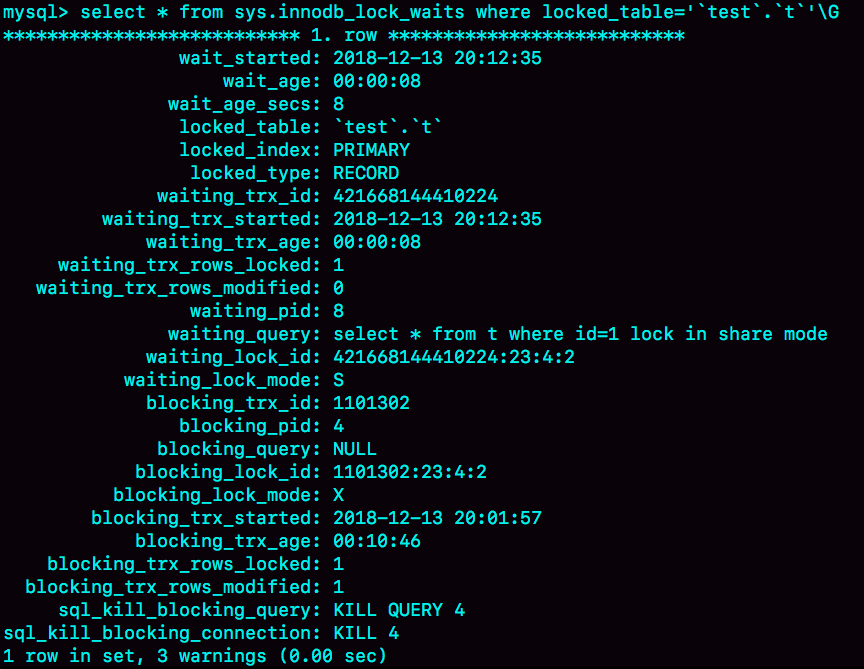

# 为什么只查一行的语句也执行地这么慢
    如果MySQL本身就有很大的压力，导致数据库服务器CPU占用率很高，或者是IO占用率很高的话，这种情况下所有的语句执行都会很慢。

[TOC]
-------------------------------------
```mysql
mysql> CREATE TABLE `t` (
  `id` int(11) NOT NULL,
  `c` int(11) DEFAULT NULL,
  PRIMARY KEY (`id`)
) ENGINE=InnoDB;

delimiter ;;
create procedure idata()
begin
  declare i int;
  set i=1;
  while(i<=100000) do
    insert into t values(i,i);
    set i=i+1;
  end while;
end;;
delimiter ;

call idata();
```

## 第一类：查询长时间不返回

### 情况一: 等MDL锁
```mysql
mysql> select * from t where id=1;
```

#### 可能原因
    `show processlist` 使用这条命令看一下当前的select语句处于什么状态

+ 1. 等MDL锁
    + a. 表示现在有一个线程正在表t上请求或者是已经持有MDL锁，结果把select给堵住了。
    + 处理方式
        + a. 找到持有MDL锁的人然后kill掉。
        + b. 使用`select blocking_pid from sys.schema_table_lock_waits;`就可以找到当前阻塞的进程id了，使用kill命令断开即可。

### 情况二: 等Flush
```mysql
mysql> select * from information_schema.processlist where id=1;
```
#### 可能原因

+ 1. 等Flush
    + a. 表示现在有一个线程正要对表t进行Flush操作。
        + a. `flush tables t with read lock;` 和 `flush tables with read lock;` 第二条语句的意思就是关闭所有打开的表。
    + 处理方式
        + a. 找到flush那条语句所在的session 然后kill掉即可。

### 情况三: 等行锁
```mysql
mysql> select * from t where id=1 lock in share mode; 
```

+ 1. 等行锁
    + a. select语句执行的时候需要获取行的读锁，如果这时候这行已经被加上了写锁就会产生互斥。
    + 处理方式
        + 要在MySQL5.7的环境下
        ```mysql
            mysql> select * from t sys.innodb_lock_waits where locked_table=`'test'.'t'`\G
        ```
        + 
        + 可以看到是四号线程拿到了行锁，只有执行KILL 4才行。这里要注意的就是直接断开连接的意思就是会直接update语句没有执行完就会进行回滚。


## 查询慢

### 情况1：
```mysql5
> select * from t where c=50000 limit 1;
```
#### 原因分析
    因为这个语句只能进行全表扫描，需要扫描5W行数据。终于知道什么是slow log了，就是查询时间超过1s的就是慢查询日志，可以通过设置set long_query_time=0将阈值设置为0，这样就可以查看语句的执行时间了。

### 情况2：
```mysql
mysql> select * from t where id=1；
```
#### 原因分析
    pass 