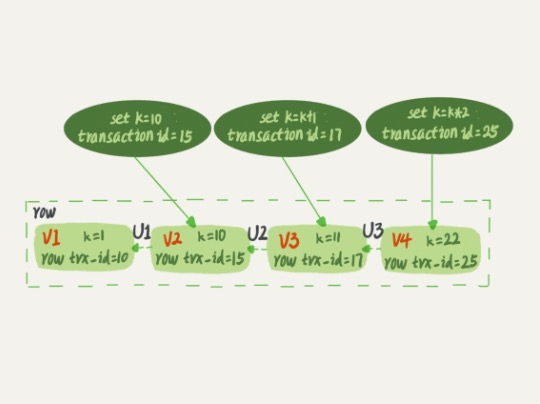
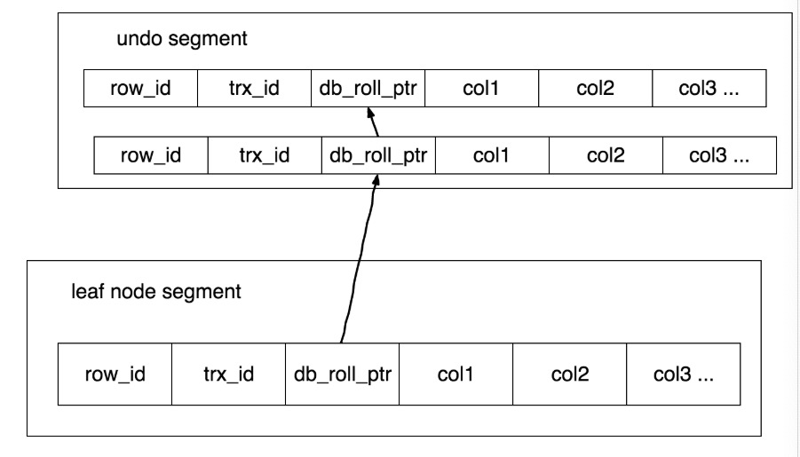
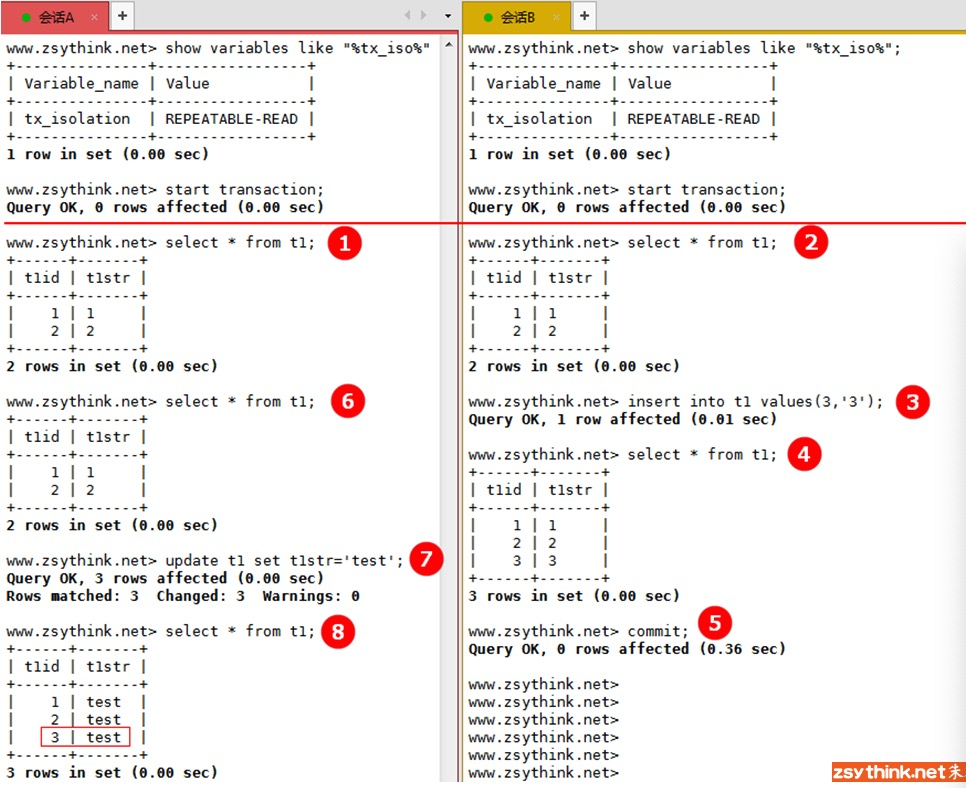

# 第八讲： 事务到底是隔离的还是不隔离的

[TOC]
---------------------------------
[这篇说的好 需翻墙观看](https://blog.jcole.us/2014/04/16/the-basics-of-the-innodb-undo-logging-and-history-system/)

[宝藏](http://mysql.taobao.org/monthly/)

[这篇文章下面附的链接说的贼好](https://liuzhengyang.github.io/2016/09/25/mysqlinnodb/)


## MVCC(Multi-Version Concurrency Control)
  为了解决在并发条件下保持数据一致性的问题。本文只介绍了以乐观并发机制实现下的MVCC。MVCC能让不同的使用者看到不同的数据，它允许使用者看到系统的一致性视图，但并不是通过锁机制来实现的。与快照相对应的另一种方法就是锁住一切用户或许可能需要的(也就是悲观并发机制实现下的MVCC)。

  **undo log 又叫做撤销日志，因为其中包含了想要撤销用户改变数据的基本动作**
### Session(会话)
  一个会话中可以有多个事务，一个会话相当于是一个数据库连接实例。

### MVCC的两种实现(还要再看看)
+ 锁机制可以控制并发操作。
  + 锁机制又分为读锁和写锁，读锁-读锁之间不需要互斥，但是写锁-读锁和写锁-写锁之间需要互斥。这样已经可以大大提高并发率了。
+ 快照。
  + 采用了一种在**读数据之前**进行快照的方法。当前事务在运行期间只能看见自己快照内的数据。

### RR中的"快照"
+ 什么时候创建
  + 在第一个查询语句执行的时候开始创建，并不是从start transaction这句开始创建。
      ```mysql
      start transaction;
      select * from t1;
      update t1 set k=k+1;
      select * from t1;
      commit;
      ```
  + 在事务一开始就创建
      ```mysql
      start transaction with consistent snapshot;
      select * from t1;
      update t1 set k=k+1;
      select * from t1;
      commit;
      ```
+ 实现原理(simple)
  + transaction id
    + InnoDB里面每个事务都有一个id, 是事务开始的时候像数据库引擎申请创建的。
  + row trx_id
    + 每一行数据都有**多个版本**，每次事务更新的时候，都会把transaction id 赋值给 row trx_id。
  + 图解：
    + 
    + U1、U2、U3就是存储在undolog中的逆向操作。
    + 
    + 事务要先判断自己能看到哪个版本的数据，可见的最新的数据作为当前事务的快照。快照是由**当前最新数据版本+undolog中的操作**生成的。
  + 代码级别的实现原理暂时不能理解所以不写了。

+ 实现原理再探
  + 记录了所有修改的版本链
    + rollback pointer(roll_ptr) undolog 包含 最近一条撤销操作的 引用.
    + 每一条撤销操作都包含了 它的 前一条 撤销操作的引用(除了一开始用来初始化的插入数据的insert)
  + 任何大小的事务，不管是进行什么操作的事务，都是通过索引进行的。所以delete操作其实不是真的删除操作，因为其它的事务在RR的隔离级别下，select的时候仍然需要看见这条数据被删除前的样子。如果在索引中也把这条记录清除了，其它事务可能就找不到它，也就无法找到它前一条记录的引用，也就无法实现一致性视图。所以删除并不是真的删除，只是设置了一个删除的标记位。
  + global view（history list） 
    + 每一条记录都有对之前版本的引用，还有一个基于历史记录的全局视图，当事务提交，它的历史记录就会连接到这个全局历史列表中。
    + 用途：
      + 在事务提交之后需要进行清理操作的时候，但是又发现事务已经完成，read-view已经没有了，但是仍然需要知道历史记录的时候。就会用到这个全局历史视图。

+ 判断某事务对当前数据各个版本的可见性
  
        对于一个事务视图来说，自己更新的数据总是可见的。补充说明：下文说的事务开始以后，指的是快照创建完成以后。
  + 对于未提交的数据版本，当前事务是不可见的。
  + 对于已经提交的数据版本，但是是在当前事务开始以后提交的，是不可见的。
  + 对于已经提交的数据版本，但是是在当前事务开始之前提交的，是可见的。


### 问题

#### 一致性读(快照读) 和 当前读
+ 快照读  
  + 在RR级别下，普通的读操作(select)都是不添加锁的，使用的是MVCC一致性读。
+ 当前读
  + ```mysql
    update T set field=value;
    delete from T where field=value;
    insert into T values();
    // 重点注意
    select .... for update;
    select .... lock in share mode;
    ```
  + [官方文档解释以上语句](https://dev.mysql.com/doc/refman/5.7/en/innodb-locks-set.html)
  + 在RR级别下，以上的SQL语句执行之前，使用的都是最新数据版本。就是RC下的效果。
#### 现象
  在事务A中，语句8应该读到的只有两行。但是却读到了当前最新的数据版本。
#### 原因
  因为update语句是当前读，读到的是最新的数据版本。
#### 事务A中的update语句是马上执行的吗？select语句呢？
+ MVCC的出现让 读-写 不互斥了。这里只是普通的读操作，并不包括上文提到的’当前读‘的SQL语句。
+ 如果把语句3换成update语句，那么3在执行的时候会拿到行锁，7在执行的时候 也要拿到行锁才能update。这就涉及到之前所说的两阶段锁释放机制，7要执行，则必须等到事务Bcommit了以后，将行锁释放。然后事务A拿到行锁，得以执行。


#### 怕文章删了链接就没了 所以先放在这里 感觉都是理解mysql的有意义的资料
```mysql
参考资料
高性能MySQL
http://dev.mysql.com/doc/refman/5.7/en/innodb-locking-transaction-model.html
http://dev.mysql.com/doc/refman/5.7/en/innodb-locks-set.html
http://hedengcheng.com/
https://github.com/hedengcheng/tech
http://lyle.smu.edu/~rkotamarti/mysql.pdf
http://mysql.taobao.org/monthly/2016/01/01/
https://www.xaprb.com/blog/2007/09/18/how-to-debug-innodb-lock-waits/
https://www.percona.com/blog/2012/03/27/innodbs-gap-locks/
```


## 思考题：
### 现在有事务A，发现第一个select语句和第二个select语句的查询结果是一样的，这种情况什么时候可能会发生呢？
```mysql
// 事务A
start transaction;
select * from T where id=c;
update T set c=0 where id=c;
select * from T where id=c;
```

### 情况1:
```mysql
create table T (id int not null, c int not null);
insert into T values(1, 1), (2, 2), (3, 3);
// 事务A                                        // 事务B
1 start transaction;
2                                               start transaction;
3 select * from T where id=c;
4                                               update T set c=c+6 where id=c;
5                                               commit;
6 update T set c=0 where id=c;
7 select * from T where id=c;
8 commit;
```
#### 解析：
  首先乐观并发机制下，读写不冲突的，所以4可以执行没问题。事务B拿到行锁，根据两阶段释放锁机制，行锁会在事务B提交了以后进行释放。但是别忘记uodate是当前读的，
  这时候再用where id=c去找数据，找不到id=c的数据了，所以没办法更新。这里select读到的就是原来的一致性视图。如果第6句成功更新了的话，第7句的select就可以看见事务B更新后的数据结果了。 是否这就是MySQL设计的既定规则。